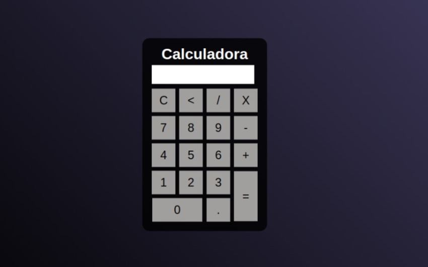

# Calculadora Simples

Para desenvolvimento desse projetinho foi utilizado HTML para base e para inserir os botões, CSS para estilizar e JavaScript para as funcionalidades.

Esta calculadora faz todas as contas basicas de divisao, miltiplicaçao, soma e subtração. A demonstração do layout esta abaixo:

